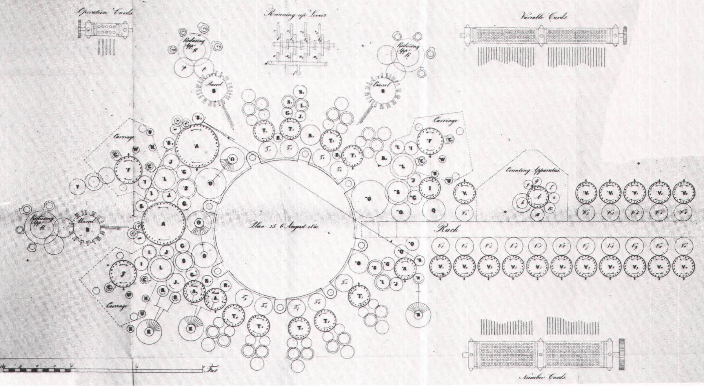

Analytic Engine
===============

{width=50%,float=right}

The Analytic Engine is the brain child of
[Charles Babbage][charles-babbage]. The machine is heavily inspired by
an other product of the industrial revolution: the
[Jacquard loom][jacquard-loom]. This loom could weave intriciate
patterns encoded into punchcards.

In this chapter we will study the plans of the Analytic engine.

[charles-babbage]: https://en.wikipedia.org/wiki/Charles_Babbage
[jacquard-loom]: https://en.wikipedia.org/wiki/Jacquard_loom
